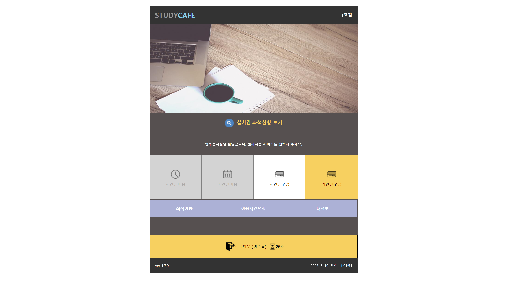
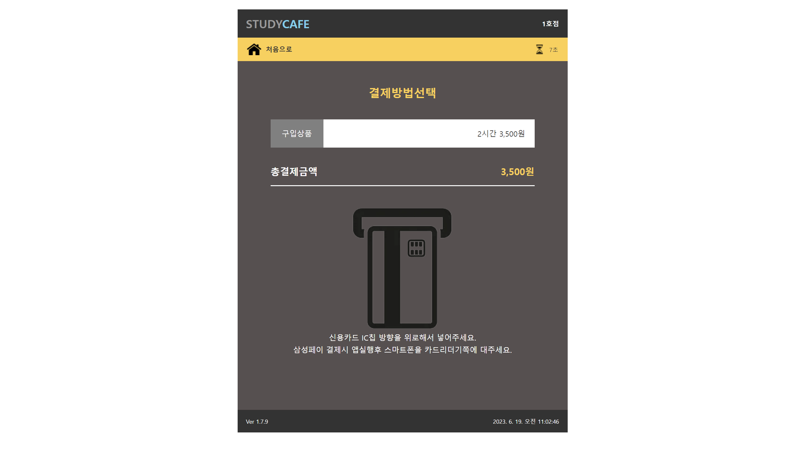
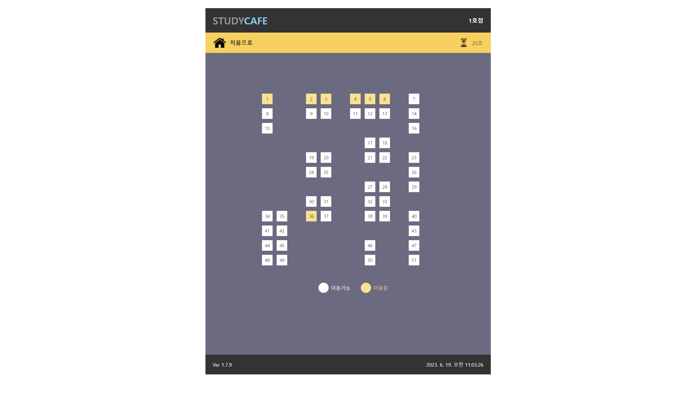
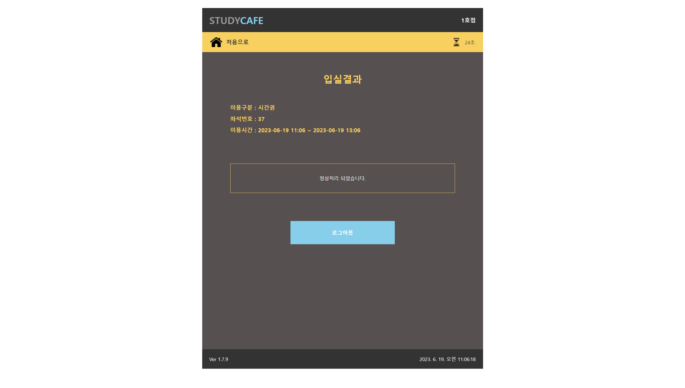
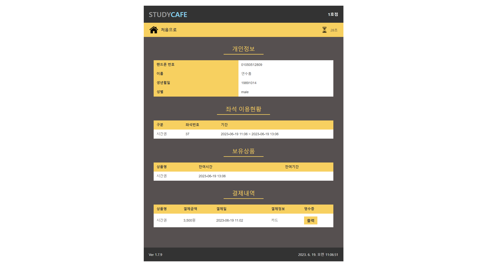
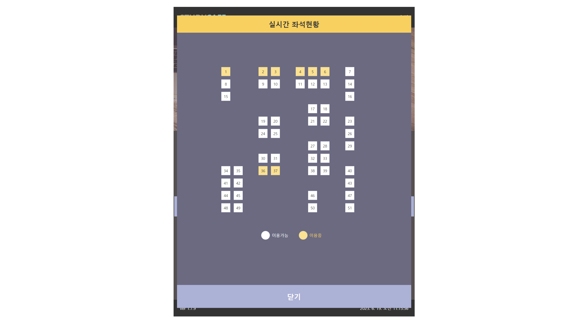
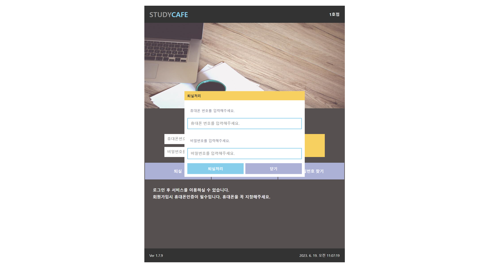
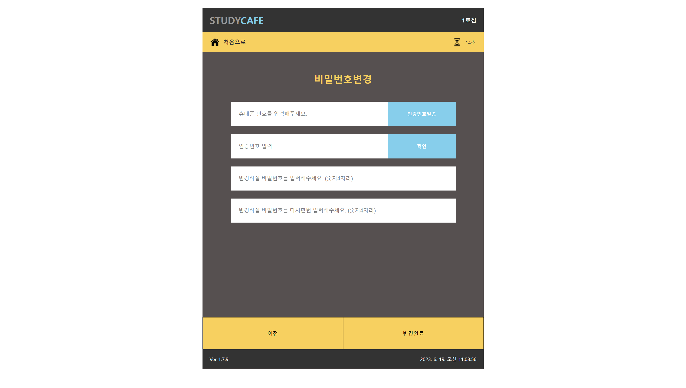

- 스터디카페 키오스크를 구현한 프로젝트 입니다.
- Product : 실시간 좌석 예약 서비스

 

# 개발기간
- 23.05.14 ~ 23.06.18 (5주)
 

# 개발자
## FE & BE
- 연수흠
 

# 기술 스택

|React|Node|Express|MongoDB|AWS|
| :--: | :--: | :--: | :--: | :--: |
|  |  |  |  | 
 

# 데모 영상
<a href="#">🔗 스터디카페 데모영상 </a>

 

# FrontEnd 구현 페이지

| 메인화면 |  | 
| :--: | :--: |
| 이용약관동의 |  |
| 회원가입 |  |
| 로그인완료 |  |
| 이용권구매 |  |
| 결제방법선택 |  |
| 결제완료 |  |
| 좌석선택 |  |
| 좌석선택_1 |  |
| 입실결과 |  |
| 마이페이지 |  |
| 실시간좌석현황 |  |
| 퇴실처리 |  |
| 비밀번호변경 |  |

